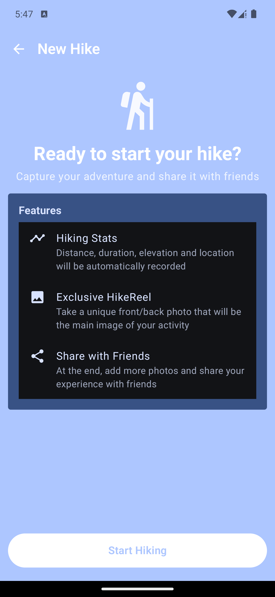
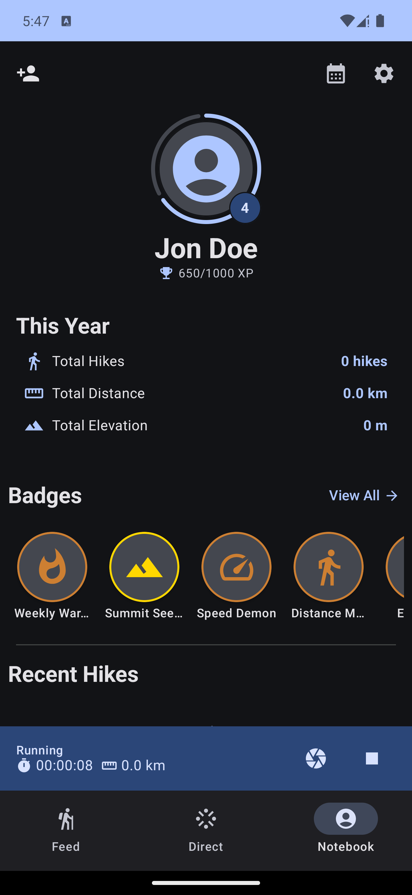
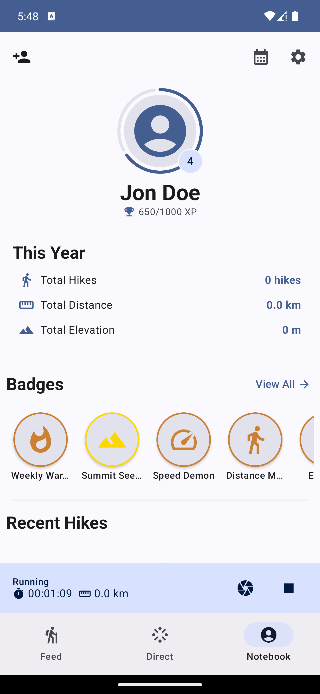
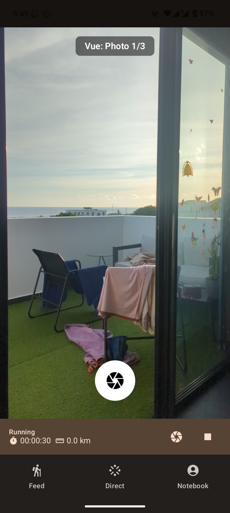
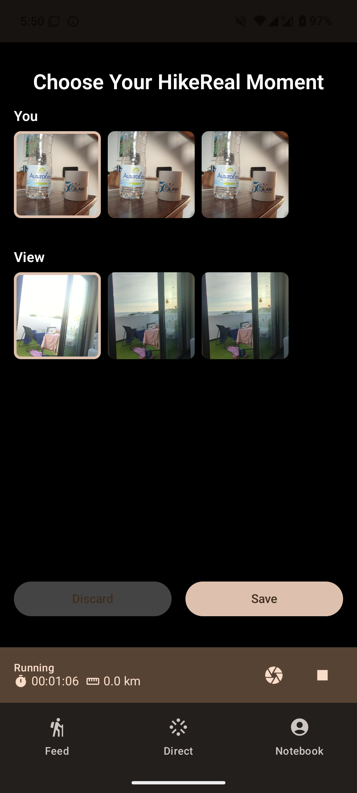
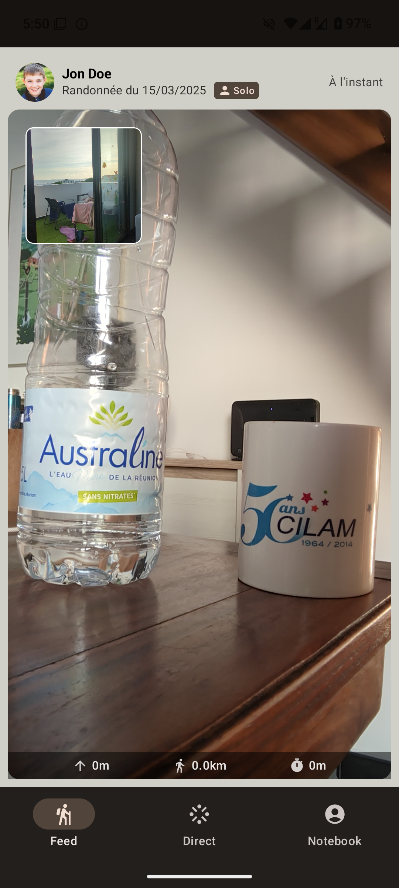

# Hiking Tracker App

This modern Android application helps users track and document their hiking experiences using:

* **Jetpack Compose:** For building a modern, declarative UI to display and interact with hiking data.
* **Room:** For persisting hiking data and photos in a local database.
* **CameraX:** For capturing and processing photos during hikes.
* **Hilt:** For dependency injection.

## Features

* Displays a list of completed hikes all over the world (mocked)
* Create fake hiking sessions with detailed information
* Capture and save photos during hiking sessions
* Review past hikes with associated photos and metrics
* Supports both light and dark themes

## Upcoming Features

* Location service during hike startup
* Adding friends for social features
* Team creation for "col quest" feature
* Map visualization with mountain passes owned by teams


## Architecture

The app follows a Model-View-ViewModel (MVVM) architecture:

* **Entity:** Represents the hiking data and data access objects (DAOs).
* **Model:** Represents the hiking data used by views.
* **View:** Jetpack Compose functions that display the UI and handle user interactions.
* **ViewModel:** Manages the UI state, interacts with the repository, and provides data to the View.

## Libraries and Components Used

* **Jetpack Compose:** For building the modern UI.
* **ViewModel:** For managing UI state.
* **Room:** For local data persistence.
* **Hilt:** For dependency injection.
* **CameraX:** For photo capturing functionality.
* **Navigation Compose:** For navigating between different screens in the app.
* **Coroutines:** For asynchronous operations.
* **Flow:** For reactive programming and observing data changes.
* **Location Services:** For tracking user's position during hikes.
* **JUnit:** For unit testing.
* **MockK:** For creating mocks and stubs in unit tests.

## Running the App

1. Clone the repository.
2. Open the project in Android Studio.
3. Build and run the app on an emulator or device.
4. Note: The app requires camera permission to function properly. 

## Testing

* **Unit Tests:** Located in the `src/test/java` directory.
* **Instrumented Tests:** Located in the `src/androidTest/java` directory.

Run tests from Android Studio or using the command line.

## Screenshots

Located in the `screenshots` directory.
[](screenshots/feed.png)
[](screenshots/new_hike.png)
[](screenshots/profile.png)
[](screenshots/feed_light.png)
[](screenshots/profile_light.png)
[](screenshots/camera.png)
[](screenshots/camera_choose.png)
[](screenshots/new_feed.png)


## License

```
Copyright 2025 Gaëtan S.

Licensed under the Apache License, Version 2.0 (the "License");
you may not use this file except in compliance with the License.
You may obtain a copy of the License at

    http://www.apache.org/licenses/LICENSE-2.0

Unless required by applicable law or agreed to in writing, software
distributed under the License is distributed on an "AS IS" BASIS,
WITHOUT WARRANTIES OR CONDITIONS OF ANY KIND, either express or implied.
See the License for the specific language governing permissions and
limitations under the License.
```